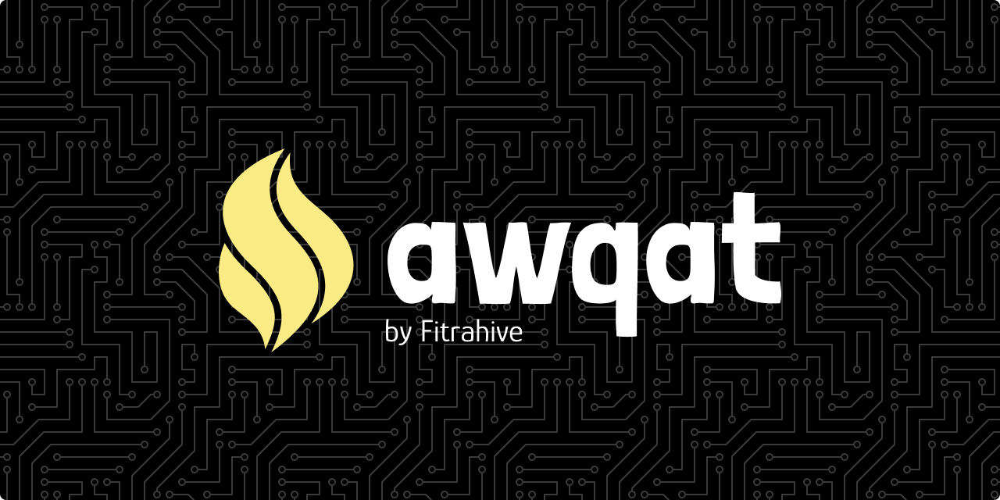

## Requirements

- PHP >= 7.4
- MariaDB/MySQL
- Composer v2
- Node.js >= v14.x `dev`
- NPM/Yarn `dev`

## Installation

1. Bismillaah
2. Clone or download this repository

   ```bash
   git clone https://github.com/fitrahive/awqat.git
   ```

3. Install PHP dependencies

   ```bash
   composer install
   ```

4. Install Node.js dependencies (development only)

   ```bash
   npm install
   # or
   yarn install
   ```

5. Copy `.env.example` file to `.env` and customize contents!
6. Export (or copy paste contents into SQL tab) [`awqat.sql`](./database/awqat.sql) to your own database.
7. MasyaAllah!

## Usage

1. Open it (could be [http://localhost/awqat/screen](http://localhost/awqat/screen)) in a browser
2. Enter username and password, by default it is:

   ```
   Username : admin
   Password : awqat
   ```

3. You can customize everything!
4. Alhamdulillah

## Features

- [x] Offline
- [x] Universal Prayer Time
- [x] Themes/Design Screen
- [x] Prayer Times Adjustment
- [x] Hijri Date
- [x] Running Text

## To-Do

- [ ] Support Portrait Orientation
- [ ] Athan Screen
- [ ] Towards Iqamah Screen
- [ ] Shuruq Screen
- [ ] Murottal
- [ ] Support RTL
- [ ] Maximize Multi-language
- [ ] Events & Eid
- [ ] Morning & Evening Dhikr

## License

Code licensed under [Apache 2.0 License](./LICENSE).

## Tech-stack

**Programming Language**

- PHP
- JavaScript

**Database**

- MariaDB
- `or` MySQL

**Web Server**

- Nginx
- `or` Apache

**Package Manager**

- Composer for PHP
- NPM `or` Yarn for Node.js

**Frontend**

- Tailwind CSS
